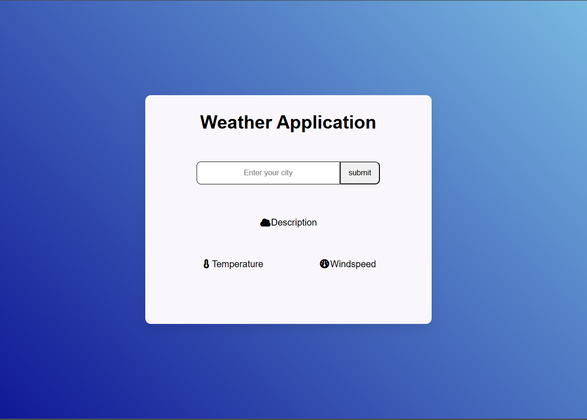
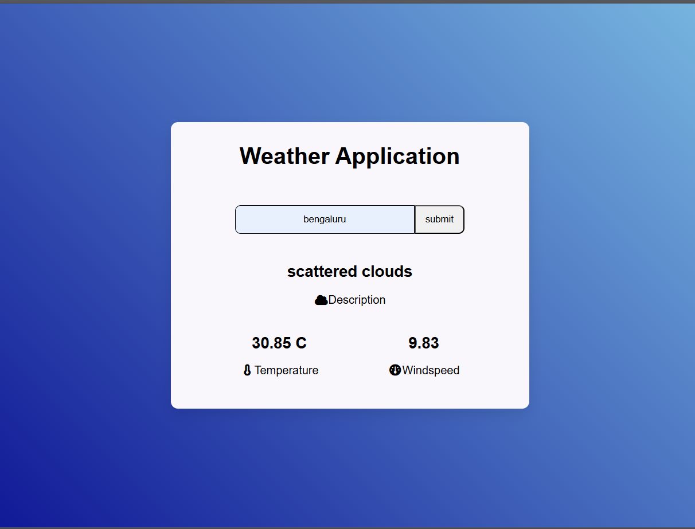

|
# [Weather App](https://vaishnavi12075.github.io/Weather_application/)

## Overview
The Weather App is a web application that provides real-time weather updates for any location. Users can enter a city name to fetch weather data such as temperature, weather description, and wind speed.

## Features
- Search weather updates by city name.
- View current weather conditions.
- Displays:
  - Temperature
  - Weather description
  - Wind speed
- Simple and clean user interface.
- Responsive design for different screen sizes.

## Tech Stack
- HTML: Structure of the web application.
- CSS: Styling and layout of the application.
- JavaScript: Functionality for fetching and displaying weather data.
- OpenWeatherMap API: Source of weather data.
- Font Awesome: Icons used in the application.

## Project Structure

```text
weather-app/
├── images
├── index.html
├── style.css
├── scriptt.js
└── README.md
```

## How to Run the Project

1. Clone the repository
```bash
git clone https://github.com/vaishnavi12075/Weather_application.git
```
2. Open the project folder.
3. Run `index.html` in your browser.
---

## API Used
OpenWeatherMap API  
https://openweathermap.org/api

## Screenshots

### Home Page


### Weather Result


---

## Future Improvements
- Add humidity and pressure details
- Add dynamic weather icons
- Add 5-day weather forecast
- Improve mobile responsiveness
- Add proper error handling for invalid city names

## Learning Outcomes
- Learned how to use APIs using fetch()
- Improved DOM manipulation skills
- Practiced responsive UI design
- Worked with asynchronous JavaScript
- Improved CSS Flexbox concepts

---

## Author
Vaishnavi
